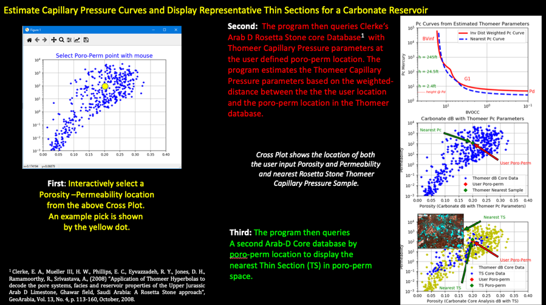

# Generate-Core-Calibrated-Thin-Sections-and-Pc-Curves
This program queries a published carbonate core analysis database having Thomeer Capillary Pressure parameters and another with links to available Thin Sections to generate a widget showing both an estimated Capillary Pressure curve and representative Thin Sections for any reasonable user defined Porosity vs. Permeability combination for this particular reservoir. The results are based entirely on the core data being employed that represents this Arab D carbonate reservoir. 

Objective:
The objective of this core integration project is to generate representative Petrophysical data for user defined porosity and permeability combination based on the core reference data. Our reference data is an Arab D carbonate core analysis database from the Middle East as published by Clerke1. The core analysis database being queried has porosity and permeability as well as the Thomeer-based Capillary Pressure parameters, BVi, Pdi and Gi used with each pore system i. There is one other core database with links to available Thin Sections based on their poro-perm relationships. The image below shows the available Thin Section images and how they vary with porosity and permeability as shown on the Porosity vs. Permeability Cross Plot. This image illustrates the textural changes of the rock over poro-perm space. 

For this project we are using a Map Inversion process to generate distance-weighted Thomeer Capillary Pressure parameters or the nearest representative Thin Section image based on the poro-perm relationships of the data. The Map Inversion process is based on the distance difference between the core analysis reference poro-perm data vs. the user defined poro-perm combination with adjustments for the uncertainty in the core measurements per Cheshire2. The core Porosity vs. core Permeability Cross Plot is being used as a map in this instance. The inverse distance of the users input of Porosity and Permeability is compared to the reference core-based Porosity and Permeability to determine the distance, weighting and the most likely representative data according from the calibration data. 

There is another project being presented in this group of repositories that utilizes normalized porosity and permeability data as well as kNN. 

1 Clerke, E. A., Mueller III, H. W., Phillips, E. C., Eyvazzadeh, R. Y., Jones, D. H., Ramamoorthy, R., Srivastava, A., (2008) “Application of Thomeer Hyperbolas to decode the pore systems, facies and reservoir properties of the Upper Jurassic Arab D Limestone, Ghawar field, Saudi Arabia: A Rosetta Stone approach”, GeoArabia, Vol. 13, No. 4, p. 113-160, October, 2008. 

2 Cheshire, Stephen, personal communications, 2008.
